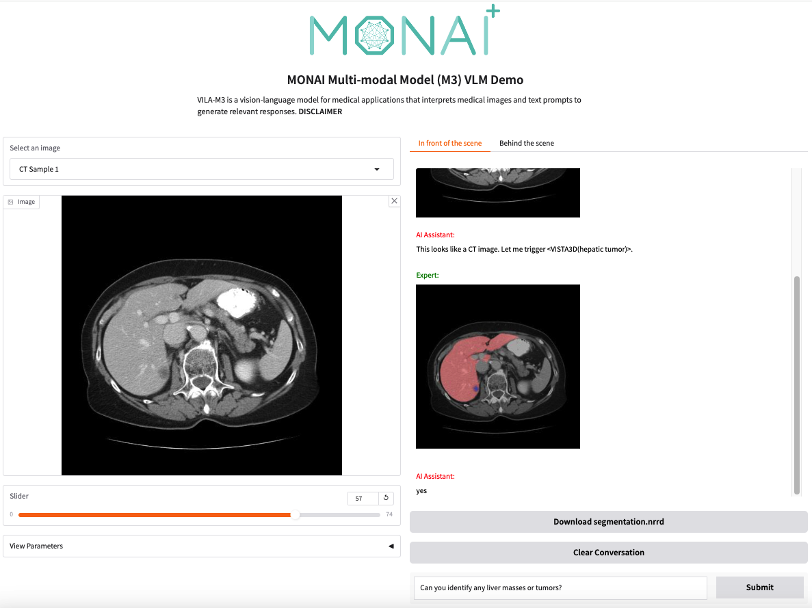

<p align="center">
  
</p>

# MONAI Vision Language Models
The repository provides a collection of vision language models, benchmarks, and related applications, released as part of Project [MONAI](https://monai.io) (Medical Open Network for Artificial Intelligence).

## 💡 News

- [2024/10/24] We presented VILA-M3 and the VLM module in MONAI at MONAI Day ([slides](./m3/docs/materials/VILA-M3_MONAI-Day_2024.pdf), [recording - coming soon!](https://www.youtube.com/c/Project-MONAI))
- [2024/10/24] Interactive [VILA-M3 Demo](https://vila-m3-demo.monai.ngc.nvidia.com/) is available online!
- [Coming soon!] Several fine-tuned healthcare checkpoints are released.

## VILA-M3

**VILA-M3** is a *vision language model* designed specifically for medical applications. 
It focuses on addressing the unique challenges faced by general-purpose vision-language models when applied to the medical domain and integrated with existing expert segmentation and classification models.

<p align="center">
  
</p>

For details, see [here](m3/README.md).

### Online Demo

Please visit the [VILA-M3 Demo](https://vila-m3-demo.monai.ngc.nvidia.com/) to try out a preview version of the model.

<p align="center">
  
</p>

### Local Demo

#### Prerequisites

1. **Linux Operating System**

1. **CUDA Toolkit 12.2** (with `nvcc`) for [VILA](https://github.com/NVlabs/VILA).

    To verify CUDA installation, run:
    ```bash
    nvcc --version
    ```
    If CUDA is not installed, use one of the following methods:
    - **Recommended** Use the Docker image: `nvidia/cuda:12.2.2-devel-ubuntu22.04`
        ```bash
        docker run -it --rm --ipc host --gpus all --net host \
            -v <ckpts_dir>:/data/checkpoints \
            nvidia/cuda:12.2.2-devel-ubuntu22.04 bash
        ```
    - **Manual Installation (not recommended)** Download the appropiate package from [NVIDIA offical page](https://developer.nvidia.com/cuda-12-2-2-download-archive)

1. **Python 3.10** **Git** **Wget** and **Unzip**:
    
    To install these, run
    ```bash
    sudo apt-get update
    sudo apt-get install -y wget python3.10 python3.10-venv python3.10-dev git unzip
    ```
    NOTE: The commands are tailored for the Docker image `nvidia/cuda:12.2.2-devel-ubuntu22.04`. If using a different setup, adjust the commands accordingly.

1. **GPU Memory**: Ensure that the GPU has sufficient memory to run the models:
    - **VILA-M3**: 8B: ~18GB, 13B: ~30GB
    - **CXR**: This expert dynamically loads various [TorchXRayVision](https://github.com/mlmed/torchxrayvision) models and performs ensemble predictions. The memory requirement is roughly 1.5GB in total.
    - **VISTA3D**: This expert model dynamically loads the [VISTA3D](https://catalog.ngc.nvidia.com/orgs/nvidia/teams/monaitoolkit/models/monai_vista3d) model to segment a 3D-CT volume. The memory requirement is roughly 12GB, and peak memory usage can be higher, depending on the input size of the 3D volume.
    - **BRATS**: (TBD)

#### Setup Environment

1. Clone the repository, set up the environment, and download the experts' checkpoints:
    ```bash
    git clone https://github.com/Project-MONAI/VLM --recursive
    cd VLM
    python3.10 -m venv .venv
    source .venv/bin/activate
    make demo_m3
    ```

#### Running the Gradio Demo

1. Navigate to the demo directory:
    ```bash
    cd m3/demo
    ```

1. Start the Gradio demo:
    ```bash
    python gradio_m3.py  \
        --modelpath /data/checkpoints/<8B-checkpoint-name> \
        --convmode llama_3 \
        --port 7860
    ```

1. Adding your own expert model
    - This is still a work in progress. Please refer to the [README](m3/demo/experts/README.md) for more details.

## Contributing

To lint the code, please install these packages:

```bash
pip install -r requirements-ci.txt
```

Then run the following command:

```bash
isort --check-only --diff .  # using the configuration in pyproject.toml
black . --check  # using the configuration in pyproject.toml
ruff check .  # using the configuration in ruff.toml
```

To auto-format the code, run the following command:

```bash
isort . && black . && ruff format .
```
