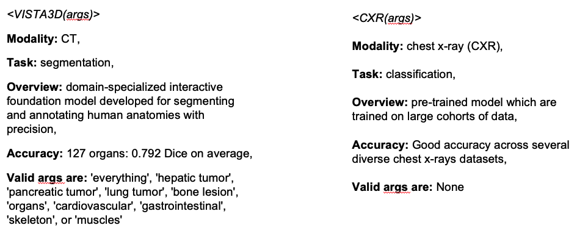
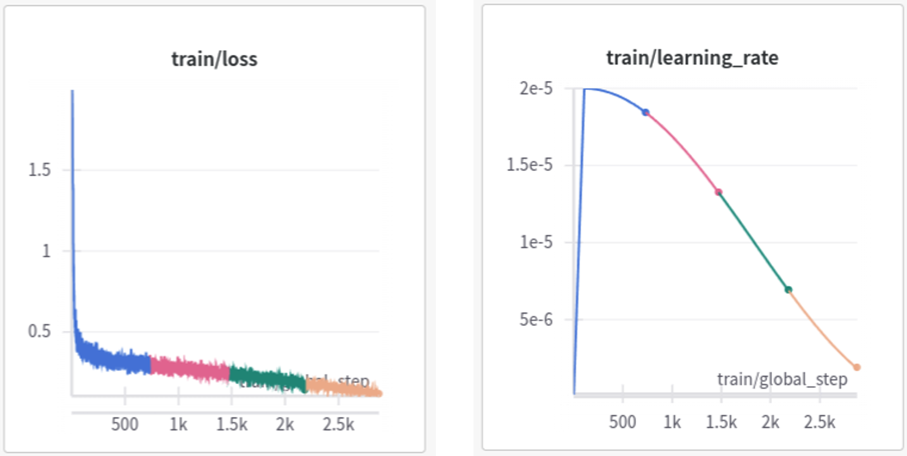

<p align="center">
  
</p>

# VILA-M3

[](../LICENSE)
[](https://creativecommons.org/licenses/by-nc-sa/4.0/deed.en)
[](https://www.python.org/downloads/release/python-3100/)

[MONAI Huggingface](https://huggingface.co/monai)

## Introduction 

**VILA-M3** is a *vision language model* designed specifically for medical applications. 
It focuses on addressing the unique challenges faced by general-purpose vision-language models when applied to the medical domain. 
The key characteristics of the model include:

1. **Expert Input in Medical Models**: VILA-M3 integrates expert knowledge into the model, 
acknowledging the demands of precision and domain knowledge of the medical field where general-purpose models may fall short.
  
2. **VILA Base Model**: VILA-M3 leverages the strong capabilities of the VILA vision-language model and fine-tunes it on healthcare-specific datasets.

3. **Hybrid Information Fusion**: VILA-M3 can incorporate 2D, 3D, and even 4D information by fusion of expert model results and VLM predictions.

4. **Open-Source MONAI Module**: The model and several fine-tuned checkpoints are released as part of project [MONAI](https://monai.io). 
We provide scripts for data preparation and a standardized module for benchmarking to evaluate the models in various medical imaging tasks.

Below is an overview of the VILA-M3 with expert model integration and feedback. 
The VLM (based on [VILA](https://github.com/NVlabs/VILA)) can select the most appropriate expert model to run given an image and user prompt. 
The resulting expert model output will be fed back to the VLM for generating the final prediction using a back-and-forth conversation.

<p align="center">
  
</p>

Model cards that describe available expert models for VILA-M3 to choose from are structured in the following way
<p align="left">
  
</p>

For an example, see the [code](./data_prepare/experts/expert_utils.py) used for generating [training data](./data_prepare/experts/README.md).

## Performance

### VQA Benchmarks
|     Model                 |     Type             | VQA-RAD*  | SLAKE-VQA | Path-VQA | Average  |
|---------------------------|----------------------|-----------|-----------|----------|----------|
|     Llava-Med             |     Task-specific    | *84.2*    | *86.8*    | *91.7*   | *87.6*   |
|     Med-Gemini-1.5T       |     Generalist       | 78.8      | **84.8**  | 83.3     | 82.3     |
|     Llama3-VILA-M3-3B     |     Generalist       | 78.2      | 79.8      | 87.9     | 82.0     |
|     Llama3-VILA-M3-8B     |     Generalist       | **84.5**  | 84.5      | 90.0     | **86.3** |
|     Llama3-VILA-M3-13B    |     Generalist       | 80.5      | 83.2      | **91.0** | 84.9     |

*Comparisons to Llava-Med & Med-Gemini are not direct as data splits are not available.

### Report Generation Benchmarks
|     Model                 |     Type             | BLUE-4*  | ROUGE*   | GREEN*   |
|---------------------------|----------------------|----------|----------|----------|
|     Llava-Med             |     Task-specific    | *1.0*    | *13.3*   | -        |
|     Med-Gemini-1.5T       |     Generalist       | 20.5     | 28.3     | -        |
|     Llama3-VILA-M3-3B     |     Generalist       | 20.2     | 31.7     | 39.4     |
|     Llama3-VILA-M3-8B     |     Generalist       | 21.5     | **32.3** | 40.0     |
|     Llama3-VILA-M3-13B    |     Generalist       | **21.6** | 32.1     | 39.3     |

*Comparisons to Llava-Med & Med-Gemini are not direct as data splits are not available.

### Classification Benchmarks
| Expert info               | w/o          | w/o        | with         | with       |
|---------------------------|--------------|------------|--------------|------------|
|     Model                 | ChestX-ray14 | CheXpert   | ChestX-ray14 | CheXpert   |
|     Med-Gemini-1.5T       | 46.7         | 48.3       | -            | -          |
|     TorchXRayVision       | -            | -          | 50           | 51.5       |
|     Llama3-VILA-M3-3B     | 48.4         | 57.4       | **51.3**     | 60.8       |
|     Llama3-VILA-M3-8B     | 45.9         | **61.4**   | 50.7         | 60.4       |
|     Llama3-VILA-M3-13B    | **49.9**     | 55.8       | 51.2         | **61.5**   |

## Demo
For and interactive demo, please access here.
The code to run the demo locally is described [here](../README.md#local-demo).

## Data preparation
To prepare the datasets for training and evaluation, follow the instructions in [data_prepare](./data_prepare).

## Training
To replicate our fine-tuning procedure, utilize the provided scripts.

For our released checkpoints, we use a slurm cluster environment.
- VILA training code with Torch distributed
- 4 nodes with 8xA100 GPUs (80 GB each)
- Cosine learning rate decay with warmup

<p align="left">
  
</p>

|     # Parameters    |     Training time    |
|---------------------|----------------------|
|     3 billion       |     5.5 hours        |
|     8 billion       |     11.0 hours       |
|     13 billion      |     19.5 hours       |

## Evaluation
To evaluate a model on the above benchmarks, follow the instructions in [eval](./eval/README.md)

## 🔒 License

- The code in this repository is released under [Apache 2.0 license](../LICENSE).
- The fine-tuned weights are released under ... (TBD)

## Citations

```
TBD
```

# Acknowledgements

- Our models are fine-tuned using [VILA code and base models](https://github.com/NVlabs/VILA).
- We thank the data providers of all the healthcare datasets detailed in [data_prepare](./data_prepare).
- The `Medical-Diff-VQA` data preparation and evaluation scripts were contributed by the authors of the [D-RAX paper](https://arxiv.org/abs/2407.02604).
- We thank the developers of expert models used for training and evaluating VILA-M3: [TorchXRayVision](https://github.com/mlmed/torchxrayvision) and models from the [MONAI Model Zoo](https://monai.io/model-zoo.html).
