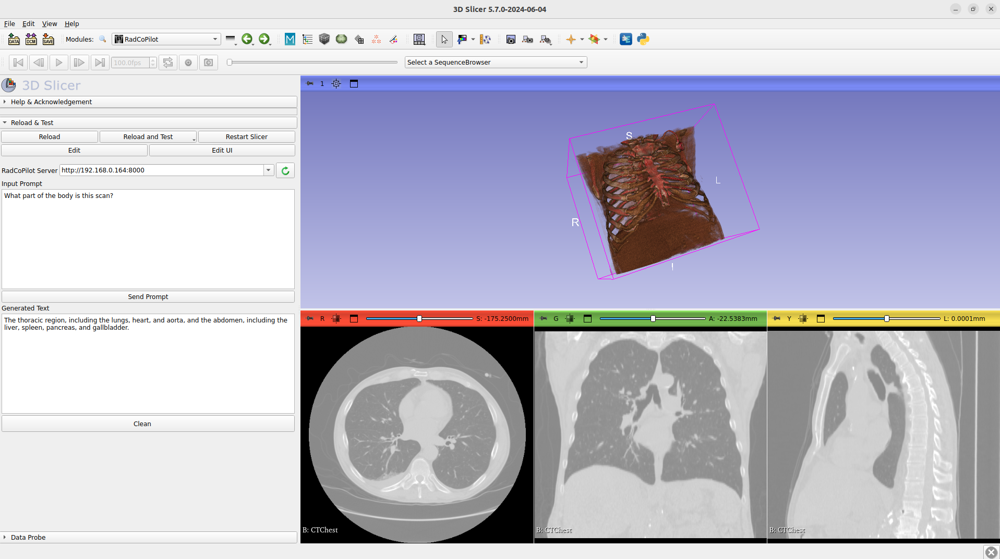

# RadCoPilot

A 3D Slicer module that integrates radiology copilots for enhanced medical image analysis and interpretation.

## Overview

RadCoPilot is a module for 3D Slicer that creates an interactive bridge between medical imaging and AI-powered radiology copilots. By leveraging the NVIDIA Holoscan platform, this tool enables seamless integration of advanced AI models for both 2D and 3D medical image analysis.

## Key Features

**Interactive Analysis**
- Real-time communication with radiology copilots via REST APIs
- Support for both 2D and 3D medical image analysis
- Direct volume transmission capabilities

**AI Integration** 
- Seamless deployment of AI models through NVIDIA Holoscan
- Advanced medical imaging insights and interpretation
- Support for state-of-the-art models like MONAI VILA-M3

## Usage

1. Load your medical image volume in 3D Slicer
2. Launch the RadCoPilot module
3. Submit your query to the copilot
4. Review the AI-generated insights

## License

This project is licensed under the MIT License.

## Acknowledgments

This project builds upon several key technologies and resources:

- NVIDIA Holoscan SDK
- East River Imaging
- RadImageNet dataset
- MONAI VILA-M3

## Contact

For questions and support, please open an issue in the GitHub repository.
